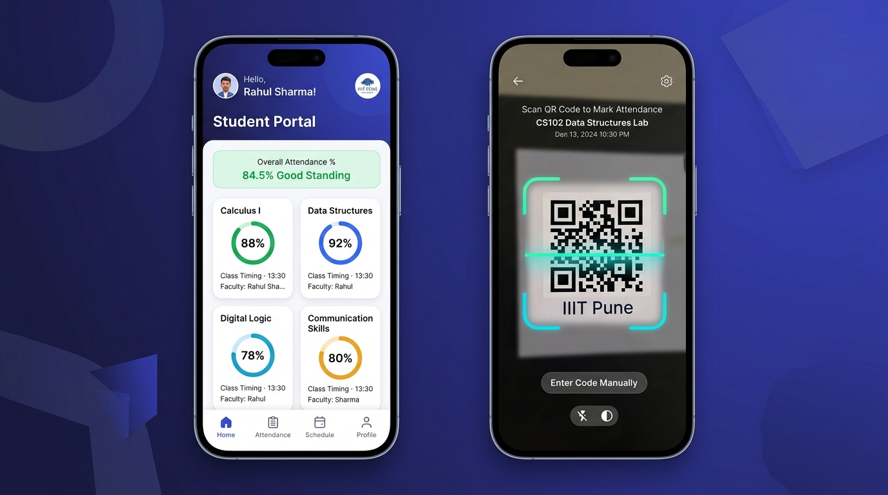
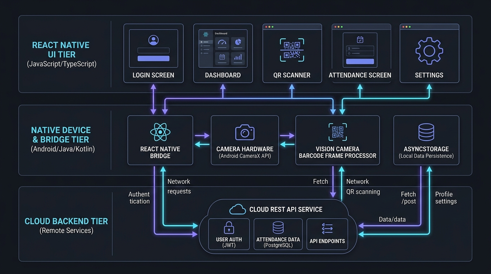
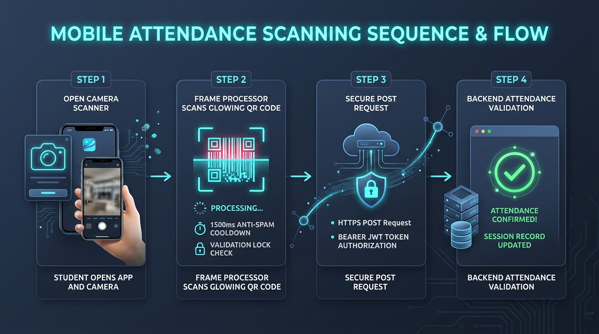

# Student Attendance System (SAS) — Android Mobile App Documentation



---

## 📑 Table of Contents
1. [Getting Started: Initializing & Running Locally](#-getting-started-initializing--running-locally)
   - [1.1 System Prerequisites](#11-system-prerequisites)
   - [1.2 Step-by-Step Setup Guide (Newly Forked)](#12-step-by-step-setup-guide-newly-forked)
   - [1.3 Connecting to the Backend API](#13-connecting-to-the-backend-api)
   - [1.4 Clean Build & Cache Invalidation](#14-clean-build--cache-invalidation)
2. [Application Architecture](#-application-architecture)
   - [2.1 High-Level Architecture Diagram](#21-high-level-architecture-diagram)
   - [2.2 App Lifecycle & Navigation Flowchart](#22-app-lifecycle--navigation-flowchart)
   - [2.3 Camera Scanner & Attendance Flow](#23-camera-scanner--attendance-flow)
3. [Codebase Structure & Directory Map](#-codebase-structure--directory-map)
4. [Screens & User Interface](#-screens--user-interface)
   - [4.1 LoginScreen](#41-loginscreen)
   - [4.2 DashboardScreen](#42-dashboardscreen)
   - [4.3 ScanScreen (Vision Camera Barcode Scanner)](#43-scanscreen-vision-camera-barcode-scanner)
   - [4.4 AttendanceScreen](#44-attendancescreen)
   - [4.5 SettingsScreen](#45-settingsscreen)
5. [Core Modules Deep Dive](#-core-modules-deep-dive)
   - [5.1 Vision Camera & Anti-Spam Scanner Engine](#51-vision-camera--anti-spam-scanner-engine)
   - [5.2 API Services Layer](#52-api-services-layer)
   - [5.3 Local Storage & Session Persistence](#53-local-storage--session-persistence)
   - [5.4 Design System & UI Components](#54-design-system--ui-components)
6. [Native Android Configuration](#-native-android-configuration)
   - [6.1 Permissions & Manifest](#61-permissions--manifest)
   - [6.2 Build Configuration & New Architecture](#62-build-configuration--new-architecture)
7. [API Contracts Consumed by the App](#-api-contracts-consumed-by-the-app)
8. [Troubleshooting & FAQ](#-troubleshooting--faq)

---

## 🚀 Getting Started: Initializing & Running Locally

This repository contains the **React Native Android Mobile Application** (`student_app`) designed for students at **IIIT Pune** to authenticate, scan classroom attendance QR codes, and monitor their attendance records.

### 1.1 System Prerequisites

Before running the project locally, verify that your development workstation has the following tools installed:

| Tool | Recommended Version | Verification Command | Notes |
| :--- | :--- | :--- | :--- |
| **Node.js** | `>= 22.11.0` (Tested on `v24.11.0`) | `node -v` | JavaScript runtime |
| **npm** | `>= 10.x` (Tested on `11.6.1`) | `npm -v` | Node package manager |
| **Java JDK** | OpenJDK 17 LTS | `java -version` | Microsoft OpenJDK 17 or Temurin 17 |
| **Android SDK** | API 34 / 35 / 36 / 37 | Check Android Studio | Build-Tools `37.0.0` |
| **Android NDK** | `27.1.12297006` | Check Android Studio | Required for C++ TurboModules |
| **Platform Tools** | Latest | `adb --version` | `adb` must be available in system PATH |

---

### 1.2 Step-by-Step Setup Guide (Newly Forked)

Follow these steps after cloning your newly forked repository:

```bash
# Step 1: Clone your fork to your local machine
git clone https://github.com/<your-username>/sas.git
cd sas

# Step 2: Install project dependencies
npm install

# Step 3: Configure Android SDK path in local.properties (Essential for fresh forks)
# Because android/local.properties is git-ignored, you must create it pointing to your SDK:
# On Windows (PowerShell one-liner):
Set-Content -Path "android/local.properties" -Value "sdk.dir=C:\\Users\\$env:USERNAME\\AppData\\Local\\Android\\Sdk"

# Or create android/local.properties manually with your user path (note double backslashes):
# sdk.dir=C:\\Users\\<YourUsername>\\AppData\\Local\\Android\\Sdk
# (On macOS/Linux: sdk.dir=/Users/<YourUsername>/Library/Android/sdk)

# Step 4: Verify your Android device or emulator is detected
adb devices
# Expected output:
# List of devices attached
# <device_id>    device
```

#### Step 5: Run the Development Server
Open two terminal windows:

**Terminal 1 — Start the Metro bundler:**
```bash
npm start
# Alternatively, start with fresh cache:
# npx react-native start --reset-cache
```

**Terminal 2 — Build and install the APK onto your device:**
```bash
npm run android
# Alternatively:
# npx react-native run-android
```

The React Native CLI will invoke Gradle, compile native C++/Kotlin dependencies, assemble the debug APK, deploy it to your connected device or emulator, and launch `MainActivity`.

---

### 1.3 Connecting to the Backend API

All API requests are routed through `src/services/api.ts`.

```typescript
// src/services/api.ts
const API_BASE_URL = 'https://student-attendance-system-kr95.onrender.com/api';
```

#### Option A: Use the Live Production/Staging Backend (Default)
By default, the app points to the deployed Render server. If you have an internet connection on your phone, **no additional setup is needed**.

#### Option B: Connect to a Local Backend Server
If you are developing against a backend running on your computer at `http://localhost:3000`:
1. Connect your Android phone via USB with USB Debugging enabled.
2. Forward port `3000` through ADB:
   ```bash
   adb reverse tcp:3000 tcp:3000
   ```
3. In `src/services/api.ts`, change `API_BASE_URL`:
   ```typescript
   const API_BASE_URL = 'http://127.0.0.1:3000/api';
   ```
   *(Cleartext traffic is enabled in `AndroidManifest.xml` via `android:usesCleartextTraffic="true"`).*

---

### 1.4 Clean Build & Cache Invalidation

If you encounter native build errors, outdated caches, or dependency conflicts:

```bash
# 1. Clean Gradle build artifacts
cd android
./gradlew clean
cd ..

# 2. Reset Metro cache and launch
npx react-native start --reset-cache

# 3. Re-run Android build in a new terminal
npm run android
```

---

## 🏛 Application Architecture

### 2.1 High-Level Architecture Diagram



```text
+─────────────────────────────────────────────────────────────────────────────+
|                        SAS ANDROID APP ARCHITECTURE                         |
+─────────────────────────────────────────────────────────────────────────────+
                                      │
                                      ▼
                        ┌───────────────────────────┐
                        │          App.tsx          │
                        │  (Session & State Root)   │
                        └─────────────┬─────────────┘
                                      │
            ┌─────────────────────────┴─────────────────────────┐
            │ [No Token / Corrupt]                              │ [Valid Token & User]
            ▼                                                   ▼
 ┌─────────────────────┐                            ┌─────────────────────┐
 │    AuthNavigator    │                            │    MainNavigator    │
 └──────────┬──────────┘                            └──────────┬──────────┘
            │                                                  │
            ▼                                   ┌──────────────┼──────────────┐
 ┌─────────────────────┐                        ▼              ▼              ▼
 │     LoginScreen     │                 ┌────────────┐ ┌────────────┐ ┌────────────┐
 │  - IIIT Pune Brand  │                 │ Dashboard  │ │ ScanScreen │ │ Attendance │
 │  - Credentials Form │                 │   Screen   │ │ (VisionCam)│ │   Screen   │
 │  - Role: 'student'  │                 └────────────┘ └────────────┘ └────────────┘
 └──────────┬──────────┘                        │              │              │
            │                                   └──────────────┼──────────────┘
            │                                                  ▼
            │                                           ┌────────────┐
            │                                           │  Settings  │
            │                                           │   Screen   │
            │                                           └────────────┘
            │                                                  │
            └─────────────────────────┬────────────────────────┘
                                      │
                                      ▼
                  ┌───────────────────────────────────────┐
                  │          SERVICES & HARDWARE          │
                  ├───────────────────────────────────────┤
                  │ • Vision Camera 5.2 (Frame Processor) │
                  │ • authStorage (AsyncStorage / JWT)    │
                  │ • api.ts (HTTP Client + Bearer Auth)  │
                  └───────────────────┬───────────────────┘
                                      │
                                      ▼ (HTTPS REST / JSON)
                  ┌───────────────────────────────────────┐
                  │           CLOUD BACKEND API           │
                  │   https://...onrender.com/api         │
                  └───────────────────────────────────────┘
```

---

### 2.2 App Lifecycle & Navigation Flowchart

The app manages authentication state centrally in `App.tsx` and dynamically selects the navigator stack:

```text
[ APP LAUNCH ]
      │
      ▼
[ restoreSession() ] ──► Read AsyncStorage (AUTH_TOKEN & USER)
      │
      ├──────────────────────────────────┐
      ▼ [Missing / Corrupted Token]      ▼ [Valid JWT & StoredUser]
┌───────────────────────────────┐  ┌──────────────────────────────────────┐
│        AUTH NAVIGATOR         │  │            MAIN NAVIGATOR            │
├───────────────────────────────┤  ├──────────────────────────────────────┤
│ 1. Render LoginScreen         │  │ 1. Render DashboardScreen            │
│ 2. Student enters email & pwd │  │    • Overall %: (Present/Total)*100  │
│ 3. POST /api/auth/login/      │  │    • Status: Good/Warning/Danger     │
│ 4. If 200 OK:                 │  │ 2. Navigate to Sub-Screens:          │
│    • saveAuthData(token, user)│  │    • ScanScreen (Vision Camera)      │
│    • setAuth({ token, user }) │  │    • AttendanceScreen (Subject list) │
└──────────────┬────────────────┘  │    • SettingsScreen (UI Stub/Logout) │
               │                   └──────────────────┬───────────────────┘
               └────────► TRANSITION ────────────────►│
                                                      │
                                                      ▼ [Tap "Logout"]
                                           ┌──────────────────────────────┐
                                           │ Prompt Confirmation Dialog   │
                                           │  • On Confirm:               │
                                           │    - clearAuthData()         │
                                           │    - setAuth(null)           │
                                           └──────────────┬───────────────┘
                                                          │
                                                          ▼
                                                  [ AUTH NAVIGATOR ]
```

---

### 2.3 Camera Scanner & Attendance Flow

This flow illustrates how `ScanScreen.tsx` processes camera frames, prevents duplicate submissions, and handles server responses:



```text
STUDENT              SCAN SCREEN                 VISION CAMERA            BACKEND API
   │                      │                            │                       │
   │─── 1. Open Scan ────►│                            │                       │
   │                      │─── 2. Request Camera ─────►│                       │
   │                      │◄── 3. Permission Granted ──│                       │
   │                      │                            │                       │
   │                      │◄── 4. Barcode Detected ────│                       │
   │                      │    (qrToken from frame)    │                       │
   │                      │                                                    │
   │                      ├─── [ANTI-SPAM GUARD CHECKS] ───────────────────────┤
   │                      │  • Already marked? (attendanceMarked.current)      │
   │                      │  • Request already in flight? (isSubmitting)       │
   │                      │  • Same QR within 1500ms? (lastScannedValue/Time)  │
   │                      ├────────────────────────────────────────────────────┤
   │                      │                                                    │
   │                      │─── 5. POST /api/student/scan ─────────────────────►│
   │                      │       { qrToken, scannedAt }                       │
   │                      │       Authorization: Bearer <token>                │
   │                      │                                                    │
   │                      │◄── 6A. 200 OK: Attendance Marked ──────────────────│
   │◄── 7A. Green Card ───│    - attendanceMarked.current = true               │
   │    & Session Info    │    - Permanently halts further scans               │
   │                      │                                                    │
   │                      │◄── 6B. 400 Bad Request: "Class Mismatch" ──────────│
   │◄── 7B. Warning Card ─│    - "QR code belongs to a different class"        │
   │    & Retry Button    │    - Reset isSubmitting lock                       │
   │                      │                                                    │
   │                      │◄── 6C. 400 Bad Request: "Session Expired" ─────────│
   │◄── 7C. Error Card ───│    - "Attendance session has ended"                │
```

---

## 📂 Codebase Structure & Directory Map

```
student_app/
├── App.tsx                     # Top-level session bootstrap & navigator switcher
├── index.js                    # React Native app registry entrypoint
├── package.json                # Project dependencies & npm run scripts
├── tsconfig.json               # TypeScript compiler configuration
├── babel.config.js             # Babel React Native preset
├── metro.config.js             # Metro JavaScript bundler configuration
├── documentation.md            # Complete application documentation
│
├── android/                    # Native Android project configuration
│   ├── app/
│   │   ├── build.gradle        # App dependencies, NDK version & signing config
│   │   ├── debug.keystore      # Development debug signing key
│   │   └── src/main/
│   │       ├── AndroidManifest.xml # Permissions (CAMERA, INTERNET) & Activity setup
│   │       └── java/com/student_app/
│   │           ├── MainActivity.kt     # Main Android ReactActivity host
│   │           └── MainApplication.kt  # TurboModules & ReactHost configuration
│   ├── build.gradle            # Root Gradle configuration (Kotlin 2.2.0, SDK 37)
│   ├── gradle.properties       # Hermes, New Architecture & JVM flags
│   └── gradlew / gradlew.bat   # Gradle build wrappers
│
├── docs/                       # Documentation assets
│   └── assets/
│       └── sas_system_overview.jpg # System architectural illustration
│
└── src/                        # Application source code
    ├── assets/
    │   └── iiit-pune-logo.webp # Institutional logo (IIIT Pune)
    │
    ├── components/             # Reusable UI component library
    │   ├── AppButton.tsx       # Primary action button with loading spinner
    │   ├── AppInput.tsx        # Styled form input field with floating labels
    │   ├── AttendanceCard.tsx  # Individual course record card (Present/Absent/Late)
    │   ├── BottomNav.tsx       # Bottom tab navigation bar
    │   ├── EmptyState.tsx      # Zero-state illustration & message
    │   ├── ErrorState.tsx      # Error banner with retry action
    │   ├── Header.tsx          # Screen header with optional back navigation
    │   ├── LoadingState.tsx    # Full-screen or container loading indicator
    │   ├── ScreenContainer.tsx # Safe-area & keyboard-avoiding screen wrapper
    │   ├── SectionHeader.tsx   # Section title row with optional action link
    │   ├── StatCard.tsx        # Summary KPI card (Present, Total, Percentage)
    │   └── index.ts            # Component barrel export
    │
    ├── navigation/             # Navigation controllers & typing
    │   ├── AppNavigator.tsx    # Root navigation switcher (Auth vs Main)
    │   ├── AuthNavigator.tsx   # Stack navigator for unauthenticated routes (Login)
    │   ├── MainNavigator.tsx   # Stack navigator for authenticated app routes
    │   └── types.ts            # TypeScript ParamList definitions for routes
    │
    ├── screens/                # Application screen views
    │   ├── LoginScreen.tsx     # Student login & credentials validation
    │   ├── DashboardScreen.tsx # High-level attendance KPIs & course cards
    │   ├── ScanScreen.tsx      # Vision Camera QR code scanner & feedback
    │   ├── AttendanceScreen.tsx# Detailed course attendance breakdown
    │   ├── SettingsScreen.tsx  # Settings UI template & logout handler
    │   └── index.ts            # Screens barrel export
    │
    ├── services/               # HTTP client & API service endpoints
    │   ├── api.ts              # Fetch wrapper with Bearer token injection
    │   ├── authService.ts      # Authentication API calls & type definitions
    │   ├── attendanceService.ts# QR scan verification & student report endpoints
    │   └── index.ts            # Services barrel export
    │
    ├── storage/                # Client-side storage layer
    │   ├── authStorage.ts      # Token & StoredUser AsyncStorage persistence
    │   ├── storageKeys.ts      # Hardcoded storage key constants
    │   └── index.ts            # Storage barrel export
    │
    └── styles/                 # Shared design system tokens
        ├── colors.ts           # Palette (Slate, Green, Amber, Red, White)
        ├── spacing.ts          # Spacing units (xs: 4 to xxl: 24)
        ├── typography.ts       # Font sizes, font weights & line heights
        └── theme.ts            # Consolidated theme export
```

---

## 🖥 Screens & User Interface

### 4.1 LoginScreen
- **Path**: `src/screens/LoginScreen.tsx`
- **Branding**: Displays the IIIT Pune emblem (`iiit-pune-logo.webp`) over deep indigo background shapes.
- **Form Controls**:
  - College Email (`keyboardType="email-address"`, auto-lowercase).
  - Password (`secureTextEntry`).
- **Role Enforcement**: Attaches `role: 'student'` automatically in the request payload.
- **Session Handshake**: Calls `login(email, password)`. If successful, calls `onLogin(token, user)`, which saves credentials in `AsyncStorage` and transitions to `DashboardScreen`.

---

### 4.2 DashboardScreen
- **Path**: `src/screens/DashboardScreen.tsx`
- **Header**: Student initial avatar, welcome greeting, and academic department subtitle.
- **Dynamic Percentage Calculation**:
  Aggregates total attended classes across all enrolled subjects:
  $$\text{Overall } \% = \left(\frac{\sum \text{present}}{\sum \text{total}}\right) \times 100$$
- **Health Indicators**:
  - `Good standing` (Green `#16A34A`): $\ge 75\%$
  - `Needs attention` (Amber `#D97706`): $60\% - 74.9\%$
  - `Low attendance` (Red `#DC2626`): $< 60\%$
- **Course Summary List**: Renders attendance breakdown cards per course.
- **Quick Links**: Direct buttons to launch the QR Scanner, open the full attendance breakdown, or navigate to settings.

---

### 4.3 ScanScreen (Vision Camera Barcode Scanner)
- **Path**: `src/screens/ScanScreen.tsx`
- **Hardware Integration**: Uses `useCameraDevice('back')` and `useCameraPermission()`.
- **Viewfinder UI**: Camera viewfinder overlay with corner targeting guides and scanning reticle.
- **Anti-Spam Controls**:
  - `isSubmitting.current`: Prevents parallel requests while an existing barcode is being processed.
  - `attendanceMarked.current`: Once successfully recorded, permanently stops scanning until leaving the screen.
  - `lastScannedValue` & `lastScannedTime`: 1500ms time-based filter preventing duplicate frame callbacks.
- **Human-Friendly Error Translation**:
  Converts raw server responses into clear actionable feedback:
  - **Class Mismatch**: *"This QR code belongs to a different class. Please scan the QR code displayed for your class."*
  - **Expired Session**: *"This attendance session has ended. Please ask your instructor to display a new QR code."*
  - **Duplicate Scan**: *"Your attendance has already been marked for this session."*
  - **No Active Session**: *"There is no active attendance session for this QR code."*

---

### 4.4 AttendanceScreen
- **Path**: `src/screens/AttendanceScreen.tsx`
- **Subject-by-Subject Breakdown**: Displays all enrolled courses with attended/total class counts and color-coded status badges.
- **Pull-To-Refresh**: Integrated native `RefreshControl` that queries `GET /api/report/student/:id`.
- **State Handling**: Comprehensive UI states for loading (`LoadingState`), empty results (`EmptyState`), and network failure (`ErrorState` with retry button).

---

### 4.5 SettingsScreen (UI Template & Logout)
- **Path**: `src/screens/SettingsScreen.tsx`
- **Implementation Status**: Primarily a **UI mockup/template screen** designed for layout purposes. Full settings functionality is not implemented.
- **Active Functional Feature**:
  - **Logout**: The only active functional feature on this screen. Tapping "Log out" opens a native confirmation modal (`Alert.alert('Logout', ...)` with destructive styling). When confirmed, it invokes `onLogout()`, which clears the authentication token and stored user object from `AsyncStorage` via `clearAuthData()` and resets the root navigation state back to `LoginScreen`.
- **UI Placeholders / Stubs (Not Connected to Backends or Services)**:
  - **Profile Option**: Tapping this only opens a simple `Alert.alert` popup displaying the student's name, email, and MIS number passed via props. There is no editing, updating, or backend sync.
  - **Notifications Switch**: A local UI toggle using `useState(true)`. Toggling the switch changes local visual state only; no push notification service (FCM, OneSignal, etc.) or native notification channels are connected.
  - **About Option**: Opens a static `Alert.alert` dialog displaying the app name and institutional credits.

---

## ⚙ Core Modules Deep Dive

### 5.1 Vision Camera & Anti-Spam Scanner Engine

The barcode scanner engine in `src/screens/ScanScreen.tsx` is configured as follows:

```typescript
// Camera and hardware permission hooks
const device = useCameraDevice('back');
const { hasPermission, requestPermission } = useCameraPermission();

// Scanner locks
const isSubmitting = useRef(false);
const attendanceMarked = useRef(false);
const lastScannedValue = useRef<string | null>(null);
const lastScannedTime = useRef(0);

const handleBarcodeScanned = useCallback(async (barcodes: any[]) => {
  if (!barcodes?.length || attendanceMarked.current || isSubmitting.current) {
    return;
  }

  const barcode = barcodes[0];
  const qrToken = barcode?.rawValue ?? barcode?.displayValue ?? barcode?.value;
  if (!qrToken) return;

  const now = Date.now();
  // 1500ms debounce to prevent multiple frame triggers on the same code
  if (qrToken === lastScannedValue.current && now - lastScannedTime.current < 1500) {
    return;
  }

  lastScannedValue.current = qrToken;
  lastScannedTime.current = now;
  isSubmitting.current = true;

  try {
    const response = await markAttendance(token, qrToken, Date.now());
    if (response.success) {
      attendanceMarked.current = true;
      setScanStatus('success');
    }
  } catch (error: any) {
    setStatusMessage(getAttendanceErrorMessage(error?.message));
    setScanStatus('error');
  } finally {
    isSubmitting.current = false;
  }
}, [token]);
```

---

### 5.2 API Services Layer

All HTTP communication is centralized in `src/services/api.ts`:

```typescript
// src/services/api.ts
const API_BASE_URL = 'https://student-attendance-system-kr95.onrender.com/api';

type ApiOptions = RequestInit & {
  token?: string;
};

export async function apiRequest<T>(
  endpoint: string,
  options: ApiOptions = {},
): Promise<T> {
  const { token, headers, ...requestOptions } = options;

  const response = await fetch(`${API_BASE_URL}${endpoint}`, {
    ...requestOptions,
    headers: {
      Accept: 'application/json',
      'Content-Type': 'application/json',
      ...(token ? { Authorization: `Bearer ${token}` } : {}),
      ...(headers || {}),
    },
  });

  let data: any = null;
  try {
    data = await response.json();
  } catch {
    // Graceful fallback if response is not JSON
  }

  if (!response.ok) {
    throw new Error(data?.message || `Request failed with status ${response.status}`);
  }

  return data as T;
}
```

---

### 5.3 Local Storage & Session Persistence

Located in `src/storage/authStorage.ts`, wrapping `@react-native-async-storage/async-storage`:

- **`STORAGE_KEYS.AUTH_TOKEN`**: `'auth_token'` — Stores the raw JWT string.
- **`STORAGE_KEYS.USER`**: `'auth_user'` — Stores the stringified `StoredUser` object.
- **Routines**:
  - `saveAuthData(token, user)`: Saves both token and user profile upon login.
  - `getAuthToken()`: Retrieves the active Bearer token.
  - `getStoredUser()`: Reads and parses the user JSON with automatic corruption recovery.
  - `clearAuthData()`: Clears both keys upon logout.

---

### 5.4 Design System & UI Components

The app uses a consistent design token system defined in `src/styles/`:

```
src/styles/colors.ts
├── Primary:        #111827 (Deep Slate / Dark Charcoal)
├── PrimaryLight:   #374151
├── Background:     #F7F8FC (Soft Cool Grey)
├── Surface:        #FFFFFF (Pure White)
├── Border:         #D1D5DB (Light Border)
├── Success:        #16A34A (Green)  / Light: #DCFCE7
├── Warning:        #D97706 (Amber)  / Light: #FEF3C7
└── Danger:         #DC2626 (Red)    / Light: #FEE2E2

src/styles/spacing.ts
├── xs: 4px | sm: 8px | md: 12px | lg: 16px | xl: 20px | xxl: 24px

src/styles/typography.ts
├── heading:     size 24, weight 800
├── section:     size 18, weight 700
├── bodyBold:    size 15, weight 700
├── body:        size 15, weight 400
├── caption:     size 13, weight 600
└── small:       size 12, weight 500
```

---

## 🤖 Native Android Configuration

### 6.1 Permissions & Manifest

Defined in `android/app/src/main/AndroidManifest.xml`:

```xml
<manifest xmlns:android="http://schemas.android.com/apk/res/android">
    <!-- Camera access for scanning attendance QR codes -->
    <uses-permission android:name="android.permission.CAMERA" />
    
    <!-- Internet access to connect with the backend REST API -->
    <uses-permission android:name="android.permission.INTERNET" />

    <application
      android:name=".MainApplication"
      android:label="@string/app_name"
      android:icon="@mipmap/ic_launcher"
      android:roundIcon="@mipmap/ic_launcher_round"
      android:allowBackup="false"
      android:theme="@style/AppTheme"
      android:usesCleartextTraffic="true"
      android:supportsRtl="true">
      <activity
        android:name=".MainActivity"
        android:label="@string/app_name"
        android:configChanges="keyboard|keyboardHidden|orientation|screenLayout|screenSize|smallestScreenSize|uiMode"
        android:launchMode="singleTask"
        android:windowSoftInputMode="adjustResize"
        android:exported="true">
        <intent-filter>
            <action android:name="android.intent.action.MAIN" />
            <category android:name="android.intent.category.LAUNCHER" />
        </intent-filter>
      </activity>
    </application>
</manifest>
```

---

### 6.2 Build Configuration & New Architecture

Configured in `android/build.gradle` and `android/gradle.properties`:

- **Compile SDK**: `37`
- **Target SDK**: `36`
- **Min SDK**: `24` (Android 7.0+)
- **Kotlin Version**: `2.2.0`
- **NDK Version**: `27.1.12297006`
- **React Native New Architecture**: `newArchEnabled=true` (Fabric UI + TurboModules)
- **JS Engine**: `hermesEnabled=true` (Hermes Engine enabled)
- **Edge-to-Edge**: `edgeToEdgeEnabled=true`

---

## 📡 API Contracts Consumed by the App

### 1. Student Login
- **Endpoint**: `POST /auth/login/`
- **Request Body**:
```json
{
  "email": "student@iiitp.ac.in",
  "password": "userPassword123",
  "role": "student"
}
```
- **Response (200 OK)**:
```json
{
  "success": true,
  "message": "Login successful",
  "serverTime": 1725302000000,
  "data": {
    "token": "eyJhbGciOiJIUzI1NiIsInR5cCI6IkpXVCJ9...",
    "user": {
      "id": "std_101",
      "firstName": "Alex",
      "lastName": "Johnson",
      "email": "student@iiitp.ac.in",
      "MIS": "112115042",
      "year": 3,
      "semester": 6,
      "department": "Computer Science & Engineering",
      "profilePic": null,
      "role": "student",
      "class": {
        "classId": "cs_2026_b",
        "name": "B.Tech CSE Div B",
        "code": "CSE-B"
      }
    }
  }
}
```

---

### 2. Mark Attendance via QR Code
- **Endpoint**: `POST /student/scan`
- **Header**: `Authorization: Bearer <token>`
- **Request Body**:
```json
{
  "qrToken": "qr_sec_98f419c8d193ba",
  "scannedAt": 1725302015000
}
```
- **Response (200 OK)**:
```json
{
  "success": true,
  "message": "Attendance marked successfully",
  "sessionId": "sess_8820",
  "sessionEndTime": 1725302600000
}
```

---

### 3. Student Attendance Records
- **Endpoint**: `GET /report/student/:studentId`
- **Header**: `Authorization: Bearer <token>`
- **Response (200 OK)**:
```json
{
  "success": true,
  "message": "Attendance records retrieved",
  "attendance": [
    {
      "courseId": "cs301",
      "courseName": "Operating Systems",
      "courseCode": "CS-301",
      "present": 28,
      "total": 30,
      "percentage": 93.3
    },
    {
      "courseId": "cs302",
      "courseName": "Database Management Systems",
      "courseCode": "CS-302",
      "present": 22,
      "total": 30,
      "percentage": 73.3
    },
    {
      "courseId": "cs303",
      "courseName": "Computer Networks",
      "courseCode": "CS-303",
      "present": 27,
      "total": 32,
      "percentage": 84.4
    }
  ]
}
```

---

## 🔧 Troubleshooting & FAQ

### Q1: `adb devices` shows an empty list or "unauthorized"
- **Cause**: USB Debugging is turned off, or the computer RSA fingerprint has not been approved on your phone.
- **Fix**: Reconnect the USB cable, look at your phone screen, and select **"Always allow from this computer"**. Then run:
  ```bash
  adb kill-server
  adb start-server
  adb devices
  ```

### Q2: Android build fails with NDK or CMake errors
- **Cause**: The project specifies NDK `27.1.12297006`.
- **Fix**: Open Android Studio > **Settings / Preferences > Appearance & Behavior > System Settings > Android SDK > SDK Tools**. Check **"Show Package Details"**, scroll down to **NDK (Side by side)**, check version `27.1.12297006`, and click Apply. Afterwards, run:
  ```bash
  cd android
  ./gradlew clean
  cd ..
  npm run android
  ```

### Q3: Camera preview is black or scanning doesn't trigger
- **Cause**: Camera permission was denied or dismissed.
- **Fix**: On your Android device, go to **Settings > Apps > student_app > Permissions > Camera** and set to **"Allow while using app"**.

### Q4: Network requests fail when testing with a local backend
- **Cause**: Android devices cannot resolve `localhost` directly to your development workstation.
- **Fix**: Run `adb reverse tcp:3000 tcp:3000` while your phone is plugged in via USB. In `src/services/api.ts`, use `http://127.0.0.1:3000/api`.

### Q5: Gradle build fails with "SDK location not found"
- **Cause**: `android/local.properties` does not exist (it is git-ignored) and the `ANDROID_HOME` environment variable is not defined on your machine.
- **Fix**: Create a file named `local.properties` inside the `android/` directory and specify your SDK path:
  ```properties
  sdk.dir=C:\\Users\\<YourUsername>\\AppData\\Local\\Android\\Sdk
  ```
  *(Remember to use double backslashes `\\` on Windows).*

---

*Documentation maintained for the IIIT Pune Student Attendance System Android App.*
